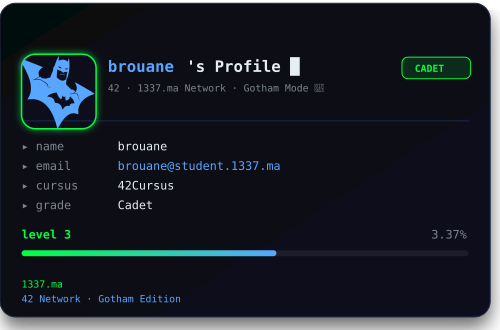
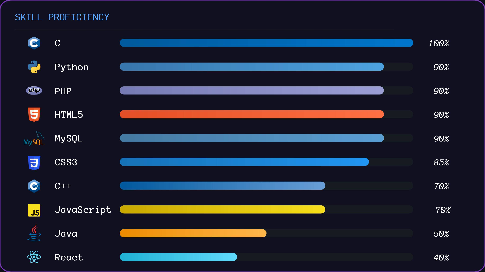

<div align="center">


<br/>

[](https://www.linkedin.com/in/bilal-rouane-01aa3a372/)
[](mailto:bilal.rouane702@gmail.com)
[](https://www.1337.ma/)

</div>

---

## 📊 1337 Intra Cadet Level

<div align="center">

<!-- <a href="https://github.com/oakoudad/badge42"></a> -->


</div>

---

## 🧑‍💻 About Me

```python
class Bilal:
    def __init__(self):
        self.name      = "Bilal Rouane"
        self.school    = "1337 — 42 Network 🎓"
        self.location  = "Morocco 🇲🇦"
        self.interests = ["Systems Programming", "Frontend Dev", "Linux"]
        self.languages = ["C", "C++", "Python", "JavaScript", "PHP"]
        self.contact   = "bilal.rouane702@gmail.com"

    def say_hi(self):
        print("Thanks for stopping by! Let's build something cool. 🤝")

me = Bilal()
me.say_hi()
```

---

## 🛠️ Languages & Tools

<div align="center">

### ⚙️ Systems & Scripting


### 🌐 Frontend


### 🗄️ Backend & Database


### 🎨 Design


</div>

---

## 📈 Skill Proficiency

<div align="center">
  
</div>

---

## 🌌 GitHub Stats

<div align="center">

<a href="https://awesome-github-stats.azurewebsites.net/index.html??cardType=level&theme=nightowl&fontFamily=Anonymous%20Pro&preferLogin=true&Points.Commits=2.8&Points.CommitsToMyRepositories=2">              </a>

<br/><br/>


<br/><br/>


<br/><br/>

</div>


<!-- Contribution Activity Graph -->
<div align="center">
  
</div>

---

## 🎯 What I'm Up To

- 🏫 Studying at **[1337](https://www.1337.ma/)** — part of the global **42 Network**
- ⚙️ Strengthening my **C** foundations through low-level peer-to-peer projects
- 🐍 Leveling up in **Python** — data structures, OOP, file I/O
- 🌐 Building frontend interfaces with **HTML / CSS / JavaScript**
- 🐧 Diving deeper into **Linux** internals and system programming
- 📬 Always open to chat: **bilal.rouane702@gmail.com**

---

## 💬 Ask Me About

`C` &nbsp;·&nbsp; `Python` &nbsp;·&nbsp; `Frontend Web` &nbsp;·&nbsp; `Linux` &nbsp;·&nbsp; `42 / 1337 curriculum`

---

<div align="center">

*"The best error message is the one that never shows up."* — Thomas Fuchs

</div>
