  

## 🧭 Currently

Studying at **1337**, part of the global **42 Network** — building projects with **C** and **Python**, exploring low-level and systems-oriented programming, and sharpening my frontend skills with **JavaScript**. Comfortable on **Linux**, and I enjoy building things from scratch rather than relying on shortcuts.

## 📊 1337 Intra Cadet Level

## 🛠️ Languages & Tools

## 📈 Skill Proficiency

  

 

## 🌌 GitHub Statistics

<table>
<tr>

<td align="center">
  
</td>

<td align="center">
  
</td>

</tr>
</table>

 

  

  

---

*"The best error message is the one that never shows up."* — Thomas Fuchs

